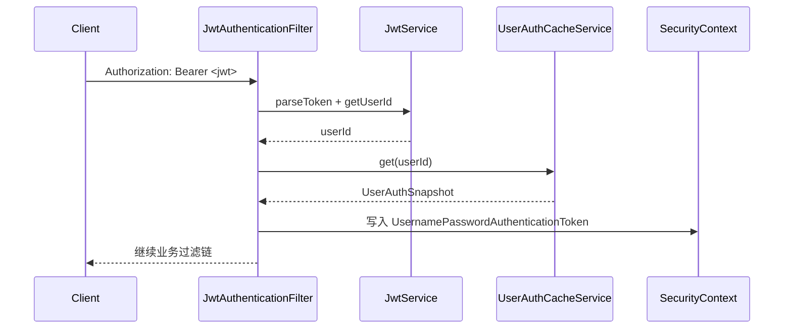
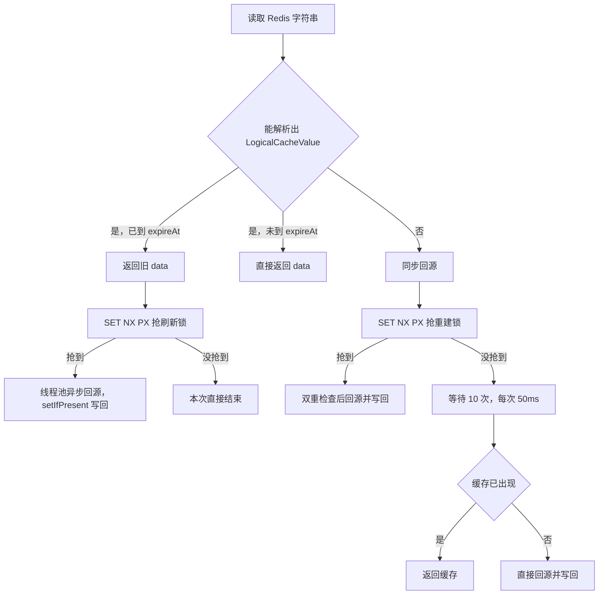

前面说了这么多的Redis的技术方案，那么实际开发怎么去实现呢？这里CBT-kepp做了一个Demo，可以看看
[这是TokenMall-一个承接上文的Demo](https://github.com/CBT-keep/TokenMall)
那么，下面这些就是技术实现的文档了。

# TokenMall 后端技术实现说明

本文只描述当前磁盘代码里真实存在的实现，不把路线图里的目标方案当成已完成能力。

## 0. 文档基线

| 项目 | 值 |
| --- | --- |
| 代码基线 | `c7ee376a606ec2b278c38b68beb5f41f1bf44444`，提交信息 `构建逻辑过期业务，解决缓存穿透问题`，提交时间 2026-09-27 19:41:10 +0800 |
| 核对日期 | 2026-09-29 |
| 后端规模 | 123 个 Java 文件，约 5080 行（不含 `target`） |
| 编译验证 | `mvn -q -DskipTests compile` 退出码 0 |
| 自动化测试 | `backend/src/test/java` 目录存在但没有测试类，`git ls-files backend/src/test` 为空 |
| 后端启动方式 | 由用户在 IntelliJ IDEA 中以 8080 端口运行，项目脚本刻意不启动后端 |

## 1. 总体架构

### 1.1 架构形态

后端是一个模块化单体：一个 Spring Boot 进程，通过 Java 包划分业务边界，不引入注册中心、配置中心、网关和微服务拆分。

```text
com.tokenmall
├─ auth          注册、登录、JWT 签发
├─ security      Spring Security、JWT 过滤器、认证缓存
├─ user          用户与 Token 账户实体、Mapper
├─ catalog       分类、商品、SKU
├─ inventory     普通库存
├─ cart          购物车
├─ order         订单、订单项、状态日志
├─ payment       模拟支付
├─ token         Token 账户、Plan、流水、发放、消费
├─ seckill       秒杀活动、Redis 预占、秒杀记录
├─ messaging     RabbitMQ 拓扑、事件信封、生产者
├─ admin         管理端接口
├─ common        统一响应、异常、分页、TraceId、MyBatis-Plus、Redis 公共组件
└─ utils         雪花 ID、布隆过滤器
```

每个业务包内部基本遵循 `controller / service / mapper / entity / dto` 分层，没有 Maven 多模块。

### 1.2 运行依赖

```text
浏览器 / 前端(5173)
        |
        v
Spring Boot 8080 ───── MySQL 3306   权威数据
        |──────────── Redis 6379    缓存、布隆过滤器、Lua 预占、认证缓存
        |──────────── RabbitMQ 5672 拓扑已声明，生产者待接入，暂无消费者
```

项目文档记录的本地中间件版本：

| 组件 | 版本 |
| --- | --- |
| MySQL | 8.0.34 |
| Redis | 3.0.504 |
| RabbitMQ | 4.3.6 |
| Erlang/OTP | 28.5 |

### 1.3 包规模

| 包 | 文件数 | 行数 |
| --- | ---: | ---: |
| `seckill` | 10 | 761 |
| `catalog` | 17 | 695 |
| `order` | 14 | 591 |
| `utils` | 4 | 490 |
| `common` | 12 | 476 |
| `token` | 13 | 434 |
| `security` | 10 | 421 |
| `admin` | 8 | 268 |
| `messaging` | 6 | 235 |
| `cart` | 7 | 218 |
| `auth` | 7 | 173 |
| `payment` | 6 | 161 |
| `inventory` | 4 | 87 |
| `user` | 4 | 57 |

## 2. 技术点摘取

下表是当前后端已经落地的技术点，按“能不能在代码里找到”归类，而不是按路线图归类。

| 技术点 | 实现位置 | 当前状态 |
| --- | --- | --- |
| Spring Boot 3.3.5 + Java 17 单体应用 | `pom.xml`、`TokenMallApplication` | 已实现 |
| Spring MVC REST 接口 | 各 `*Controller` | 已实现 |
| Jakarta Bean Validation 参数校验 | `*Request` DTO + `@Valid` | 已实现 |
| 统一响应结构 `code/message/data/traceId` | `ApiResponse` | 已实现 |
| 全局异常处理与错误码 | `GlobalExceptionHandler`、`ErrorCode` | 已实现 |
| 请求链路 ID | `TraceIdFilter` + MDC | 已实现，安全层 401/403 的 traceId 需实测确认 |
| Spring Security 无状态过滤链 | `SecurityConfig` | 已实现 |
| JWT 签发与校验（HMAC-SHA，算法随密钥长度） | `JwtService`、`JwtAuthenticationFilter` | 已实现 |
| 密码 BCrypt | `SecurityConfig.passwordEncoder()` | 已实现 |
| Caffeine 本地认证缓存 | `UserAuthCacheConfig`、`UserAuthCacheService` | 已实现 |
| Redis 认证缓存 | `UserAuthCacheService` | 已实现 |
| MyBatis-Plus BaseMapper | 各 `*Mapper` | 已实现 |
| MyBatis-Plus 分页插件 | `MybatisPlusConfig` | 已实现 |
| MyBatis-Plus 逻辑删除 | `application.yml` + `@TableLogic` | 已实现 |
| 雪花算法订单号 | `SnowflakeIdGenerator`、`IdUtils` | 已实现 |
| 商品列表普通 JSON 缓存 + TTL 抖动 | `ProductService.list`、`CacheTtl` | 已实现 |
| 逻辑过期缓存 + 异步刷新 | `LogicalCacheSupport`、`LogicalCacheValue` | 已实现 |
| 缓存重建 Redis 分布式锁 + Lua 解锁 | `LogicalCacheSupport` | 已实现 |
| 布隆过滤器防缓存穿透 | `BloomFilterUtil`、`BloomFilterInitializer` | 已实现 |
| Redis Lua 秒杀预占库存 | `SeckillService.SECKILL_SCRIPT` | 已实现 |
| Redis Lua 秒杀预占补偿 | `SeckillService.COMPENSATE_SCRIPT` | 已实现 |
| MySQL 条件扣减秒杀库存 | `SeckillActivityMapper.deductStock` | 已实现 |
| 订单状态机与状态日志 | `OrderService`、`order_status_log` | 已实现主链路 |
| `requestId` 幂等入口 | 订单、支付、秒杀、Token 消费 | 部分实现，见第 10 节 |
| Token 资源包与 Plan 台账 | `TokenGrantService`、`TokenAccountService` | 已实现 |
| RabbitMQ 交换机/队列/绑定/DLX | `RabbitMQConfig`、`MessagingNames` | 拓扑已声明 |
| RabbitMQ 启动时初始化拓扑 | `RabbitTopologyInitializer` | 已实现 |
| RabbitMQ 事件信封 | `MessageEnvelope`、`OrderPaidEvent` | 已定义 |
| RabbitMQ 生产者 | `OrderEventPublisher` | 已实现但没有调用点 |
| RabbitMQ 消费者、重试、消费幂等 | `backend/src/main/java` | 未实现，代码中无 `@RabbitListener` |
| Outbox / 消费日志 | `message_outbox`、`mq_consume_log` 表 | 只有建表 SQL，没有 Java 代码 |
| 普通库存并发控制 | `InventoryService` | 故意保留查询后更新的基线问题 |
| 订单超时关闭 | `mall_order.expire_time`、延迟队列 | 字段和队列存在，没有生产者和消费者 |
| Actuator / 指标 / 链路追踪平台 | 依赖与配置 | 未引入 |

## 3. 启动、依赖与配置

### 3.1 启动入口

`TokenMallApplication` 上只有三个关键注解：

```java
@SpringBootApplication
@MapperScan("com.tokenmall")
@EnableScheduling
```

`@EnableScheduling` 当前服务于 `BloomFilterInitializer.ensureReady()` 的定时重建。各 Mapper 同时标注了 `@Mapper`，与 `@MapperScan` 形成双保险。

### 3.2 Maven 依赖

| 依赖 | 版本 | 用途 |
| --- | --- | --- |
| `spring-boot-starter-parent` | 3.3.5 | 统一版本管理 |
| `spring-boot-starter-web` | 随 Boot | Spring MVC |
| `spring-boot-starter-validation` | 随 Boot | Jakarta Validation |
| `spring-boot-starter-security` | 随 Boot | 认证授权 |
| `spring-boot-starter-data-redis` | 随 Boot | Redis |
| `spring-boot-starter-amqp` | 随 Boot | RabbitMQ |
| `mybatis-plus-spring-boot3-starter` | 3.5.9 | 持久层 |
| `mybatis-plus-jsqlparser` | 3.5.9 | 分页解析 |
| `mysql-connector-j` | 随 Boot | MySQL 驱动 |
| `caffeine` | 随 Boot | 本地认证缓存 |
| `jjwt-api / impl / jackson` | 0.12.6 | JWT |
| `lombok` | 随 Boot，optional | 实体与构造器简化 |
| `hutool-all` | 5.8.47 | 工具库，当前后端主代码没有 `import cn.hutool` |
| `spring-boot-starter-test`、`spring-security-test` | 随 Boot | 测试依赖，当前无测试类 |

没有引入 Actuator、OpenAPI/Swagger、Redis 连接池专用配置、消息转换器显式配置或分布式追踪组件。

### 3.3 关键配置

`backend/src/main/resources/application.yml` 是唯一资源文件，没有 Mapper XML。

| 配置 | 默认值 | 说明 |
| --- | --- | --- |
| `server.port` | `${SERVER_PORT:8080}` | 服务端口 |
| `spring.datasource.url` | `jdbc:mysql://127.0.0.1:3306/token_mall?...` | MySQL，时区 `Asia/Shanghai` |
| `MYSQL_USERNAME` | `token_mall_dev` | 开发库账号 |
| `MYSQL_PASSWORD` | `ChangeMe_123456` | 开发库密码 |
| `spring.data.redis.host/port` | `127.0.0.1:6379` | Redis |
| `spring.data.redis.timeout` | `2s` | Redis 超时 |
| `spring.rabbitmq.virtual-host` | `tokenmall` | RabbitMQ 虚拟主机 |
| `spring.rabbitmq.dynamic` | `true` | 创建 `RabbitAdmin` 并声明拓扑 |
| `spring.jackson.time-zone` | `Asia/Shanghai` | Jackson 时区 |
| `spring.jackson.date-format` | `yyyy-MM-dd HH:mm:ss` | Jackson Date 格式 |
| `spring.jackson.default-property-inclusion` | `non_null` | 空字段不序列化 |
| `mybatis-plus.configuration.map-underscore-to-camel-case` | `true` | 下划线转驼峰 |
| `mybatis-plus.configuration.log-impl` | `StdOutImpl` | 控制台打印 SQL |
| `mybatis-plus.global-config.db-config.logic-delete-field` | `deleted` | 逻辑删除字段 |
| `tokenmall.bloom.retry-interval-ms` | 60000 | 布隆过滤器重建检查间隔 |
| `tokenmall.jwt.secret` | 本地占位密钥 | JWT HMAC 密钥 |
| `tokenmall.jwt.expires-seconds` | 7200 | JWT 有效期 |
| `tokenmall.auth-cache.local-ttl-seconds` | 300 | Caffeine TTL |
| `tokenmall.auth-cache.redis-ttl-seconds` | 1800 | Redis 认证缓存 TTL |
| `tokenmall.auth-cache.local-maximum-size` | 10000 | Caffeine 最大条目数 |
| `tokenmall.cors.allowed-origin` | `http://localhost:5173` | 当前 Java 代码没有读取这个属性，实际 CORS 在 `SecurityConfig` 中硬编码 |

### 3.4 启动期任务

| 组件 | 触发时机 | 行为 |
| --- | --- | --- |
| `BloomFilterInitializer` | `ApplicationRunner.run` + `@Scheduled` | 检查 `mall:bloom:product` 和 `mall:bloom:seckill:activity` 的 ready 标记，缺失则从 MySQL 全量 ID 重建 |
| `RabbitTopologyInitializer` | `ApplicationRunner.run` | 调用 `RabbitAdmin.initialize()` 声明交换机、队列和绑定；RabbitMQ 不可用时只记录 warn，不阻止应用启动 |

## 4. Web 通用层

### 4.1 统一响应

`ApiResponse<T>` 是 record，字段固定为：

```json
{
  "code": 0,
  "message": "OK",
  "data": {},
  "traceId": "7f3c..."
}
```

成功使用 `code = 0`；`traceId` 直接取 `MDC.get("traceId")`。

### 4.2 请求链路 ID

`TraceIdFilter` 是 `OncePerRequestFilter`：

1. 读取请求头 `X-Trace-Id`。
2. 没有或为空白时生成去掉连字符的 UUID。
3. 写入 MDC，同时回写响应头 `X-Trace-Id`。
4. `finally` 中清理 MDC。

`ApiResponse` 的 traceId 与响应头来自同一个值。注意：该 Filter 没有显式 `@Order`，而 Spring Security 过滤链默认 order 为 `-100`；由 Security 的 entry point / denied handler 直接写出的 401/403 响应可能拿不到 MDC 值，建议用 curl 实测确认。

### 4.3 全局异常处理

`GlobalExceptionHandler` 处理四类异常：

| 异常 | HTTP 状态 | 响应 code |
| --- | ---: | ---: |
| `BusinessException` | 取 `ErrorCode.httpStatus` | 取 `ErrorCode.code`，message 使用异常自带文案 |
| `MethodArgumentNotValidException` | 400 | 40001 |
| `ConstraintViolationException` | 400 | 40001 |
| 其他 `Exception` | 500 | 50001，对外只返回通用文案，服务端记录完整堆栈 |

`DataIntegrityViolationException`、`DuplicateKeyException` 当前没有单独处理，会落到 500 分支。

### 4.4 错误码

`ErrorCode` 当前定义：

| code | HTTP | 含义 |
| ---: | ---: | --- |
| 40001 | 400 | 参数错误 |
| 40002 | 400 | 库存不足 |
| 40003 | 400 | 商品不可购买 |
| 40004 | 400 | 订单状态不允许操作 |
| 40005 | 400 | 秒杀未开始或已结束 |
| 40006 | 400 | 超过购买限制 |
| 40101 | 401 | 未登录或 Token 无效 |
| 40301 | 403 | 无权限 |
| 40401 | 404 | 资源不存在 |
| 40901 | 409 | 重复请求 |
| 50001 | 500 | 系统内部错误 |

`docs/api/api-contract.md` 里还写了 50002、50003，但 Java 枚举中没有这两个值。

### 4.5 参数校验

所有写接口的请求体都是 record DTO，并在 Controller 参数上使用 `@Valid`。校验注解覆盖：

- `@NotBlank`：用户名、密码、昵称、requestId、订单号等。
- `@NotNull`：ID、数量、金额、时间段等。
- `@Min(1)`：数量、秒杀库存、限购数、Token 消费额。
- `@Size`：用户名 3 到 50，密码 6 到 64，昵称最多 50。
- `@DecimalMin("0.00")`：价格。
- `@PositiveOrZero`：库存和购买上限。

### 4.6 分页

`MybatisPlusConfig` 注册 `PaginationInnerInterceptor(DbType.MYSQL)`；分页返回统一为 `PageResult<T>(records, page, size, total)`。

使用分页的接口：

- `GET /api/v1/products`
- `GET /api/v1/orders`
- `GET /api/v1/admin/orders`

Token 流水接口当前直接返回 `List`，不支持 `page/size`，与 API 契约文档中的 `?page=1&size=20` 不一致。

## 5. 安全与认证

### 5.1 Spring Security 过滤规则

`SecurityConfig` 的关键行为：

- `csrf.disable()`。
- `SessionCreationPolicy.STATELESS`。
- CORS 开启，允许 `http://localhost:*` 和 `http://127.0.0.1:*`，允许携带凭证，暴露 `X-Trace-Id`。
- `/api/v1/auth/**` permitAll。
- `GET /api/v1/categories/**`、`GET /api/v1/products/**` permitAll。
- `GET /api/v1/seckill/activities/**` permitAll。
- `/api/v1/admin/**` 需要 `ROLE_ADMIN`。
- 其余请求需要认证。
- 认证失败返回 401 JSON，权限不足返回 403 JSON。
- `JwtAuthenticationFilter` 插在 `UsernamePasswordAuthenticationFilter` 之前。

`GET /api/v1/seckill/requests/{requestId}` 不在公开匹配范围内，必须带 Token。

### 5.2 JWT

`JwtService` 使用 jjwt 0.12.6：

- 算法：`Keys.hmacShaKeyFor(secret bytes)`，即 HMAC-SHA 系列，密钥来自 `tokenmall.jwt.secret`。
- Token 只放最小身份信息：`sub = userId`、`uid = userId`、`iat`、`exp`。
- 有效期：`tokenmall.jwt.expires-seconds`，默认 7200 秒。
- 不包含用户名、角色、密码。
- `getUserId` 优先读取数值型 `uid`，兼容旧 Token 时回退 `sub`。
- 没有 Refresh Token、Token 黑名单或版本号。

### 5.3 请求认证链路



解析失败、Token 非法、用户被禁用、用户不存在都返回 401 JSON，并清空 SecurityContext。

### 5.4 认证缓存

`UserAuthCacheService` 是本地 + Redis 两级缓存：

```text
Caffeine 本地缓存 -> Redis -> MySQL -> 回填 Redis 和 Caffeine
```

| 项目 | 值 |
| --- | --- |
| 本地缓存 | Caffeine，`expireAfterWrite` 默认 300 秒，最大 10000 条，开启 `recordStats` |
| Redis Key | `mall:user:auth:{userId}` |
| Redis TTL | 默认 1800 秒 |
| 缓存值 | `userId`、`username`、`role`、`enabled` |
| 主动失效 | `evict(userId)` 同时清 Caffeine 和 Redis |
| 降级 | Redis 读写异常时只记日志，退回本地缓存和 MySQL |

`AuthService.login` 仍然按用户名查一次 MySQL 校验 BCrypt 密码，成功后写入认证缓存并签发 JWT。`AuthService.currentUser()` 走 `GET /api/v1/auth/me` 时直接查 MySQL，不复用认证缓存。

### 5.5 CORS

实际 CORS 配置位于 `SecurityConfig.corsConfigurationSource()`，不是配置属性：

- `allowedOriginPatterns`：`http://localhost:*`、`http://127.0.0.1:*`。
- `allowedMethods`：GET、POST、PUT、DELETE、OPTIONS。
- `allowedHeaders`：`*`。
- `exposedHeaders`：`X-Trace-Id`。
- `allowCredentials`：`true`。

`application.yml` 中的 `tokenmall.cors.allowed-origin` 和 `CORS_ALLOWED_ORIGIN` 目前没有任何 Java 代码读取。

## 6. 持久层与数据库

### 6.1 MyBatis-Plus 使用方式

- 每个业务 Mapper 继承 `BaseMapper<T>`。
- 绝大多数查询使用 `Wrappers.lambdaQuery()` 构造。
- 唯一手写 SQL 是 `SeckillActivityMapper.deductStock` 的条件更新。
- 没有 XML Mapper。
- 逻辑删除由全局配置 `deleted` 驱动，被 `@TableLogic` 标注的实体自动追加 `deleted = 0`。
- 分页查询统一走 `selectPage`。

### 6.2 实体与技术约定

| 约定 | 实现 |
| --- | --- |
| 数据库主键 | `@TableId(type = IdType.AUTO)`，自增 `BIGINT` |
| 业务唯一号 | 订单号 `ORD_ + 雪花 ID`；支付号 `PAY + UUID 前 24 位`；Token 流水号 `TT + UUID 前 24 位` |
| 逻辑删除 | `product`、`product_category`、`product_sku`、`seckill_activity`、`sys_user` 使用 `@TableLogic` |
| 无逻辑删除 | 购物车、库存、订单、支付、Token、秒杀记录表 |
| 金额 | `BigDecimal`，数据库 `DECIMAL(10,2)` |
| 时间 | `LocalDateTime`，数据库 `DATETIME` |
| 乐观锁 | `inventory.version` 字段存在，但实体没有 `@Version`，MyBatis-Plus 乐观锁插件也没有注册 |
| 外键 | 不建物理外键，关系由应用维护 |

### 6.3 雪花算法

`SnowflakeIdGenerator` 是手写实现：

```text
1 位符号位 + 41 位时间戳 + 5 位数据中心 + 5 位机器 + 12 位序列号
```

| 项目 | 值 |
| --- | --- |
| 起始时间戳 | 1704067200000（2024-01-01 00:00:00） |
| 数据中心 ID | `snowflake.datacenter-id`，默认 1 |
| 机器 ID | `snowflake.machine-id`，默认 1 |
| 每毫秒上限 | 4096 个 ID |
| 时钟回退 | 回退不超过 5 毫秒时自旋等待并重试，超过则拒绝生成 |
| 线程安全 | `nextId()` 使用 `synchronized` |

`IdUtils` 通过 `@PostConstruct` 把 Spring 容器里的生成器赋给静态字段，业务代码用 `IdUtils.generateId()` 生成订单号。`snowflake.*` 当前没有写进 `application.yml`，使用默认值 1/1。

### 6.4 数据库表

`db/01_schema.sql` 定义 19 张表：

| 表 | 用途 | 当前是否被 Java 代码使用 |
| --- | --- | --- |
| `sys_user` | 用户、密码、角色、状态 | 是 |
| `user_token_account` | 资源包余额、Plan 余额、累计值 | 是 |
| `product_category` | 商品分类 | 是 |
| `product` | 商品主数据 | 是 |
| `product_sku` | 商品 SKU | 是 |
| `inventory` | SKU 库存 | 是 |
| `cart_item` | 购物车 | 是 |
| `mall_order` | 订单主表 | 是 |
| `mall_order_item` | 订单商品快照 | 是 |
| `order_status_log` | 订单状态流转日志 | 是 |
| `payment_record` | 模拟支付记录 | 是 |
| `user_token_plan` | 用户 Token Plan | 是 |
| `token_transaction` | Token 流水 | 是 |
| `token_usage_record` | Token 消费记录 | 是 |
| `seckill_activity` | 秒杀活动 | 是 |
| `seckill_record` | 秒杀记录 | 是 |
| `message_outbox` | Outbox 学习表 | 否 |
| `idempotency_record` | HTTP 幂等学习表 | 否 |
| `mq_consume_log` | MQ 消费幂等表 | 否 |

关键唯一索引：

| 表 | 唯一索引 | 作用 |
| --- | --- | --- |
| `sys_user` | `uk_username` | 用户名唯一 |
| `user_token_account` | `uk_user_id` | 一个用户一个账户 |
| `product_sku` | `uk_sku_code` | SKU 编码唯一 |
| `inventory` | `uk_sku_id` | 一个 SKU 一条库存 |
| `cart_item` | `uk_user_sku` | 同一用户同一 SKU 只有一条购物车项 |
| `mall_order` | `uk_order_no` | 订单号唯一 |
| `mall_order` | `uk_request_id` | 请求幂等键全局唯一 |
| `payment_record` | `uk_order_no`、`uk_request_id` | 一单一次支付、请求幂等 |
| `token_transaction` | `uk_transaction_no`、`uk_idempotency_key` | 流水号与幂等键唯一 |
| `token_usage_record` | `uk_request_id` | 消费请求唯一 |
| `seckill_record` | `uk_activity_user`、`uk_request_id` | 活动内用户唯一、请求唯一 |

### 6.5 SQL 脚本

| 文件 | 内容 |
| --- | --- |
| `db/01_schema.sql` | 建库、19 张表、索引、学习检查点注释 |
| `db/02_seed.sql` | admin 账号、6 个商品、6 个 SKU、库存、1 个 RUNNING 秒杀活动 |
| `db/03_create_dev_user.sql` | 创建 `token_mall_dev` 开发账号并授权 |
| `db/04_cleanup_test_data.sql` | 手工清理压测/验证数据，重置库存、销量和 Token 余额 |

种子账号：`admin / admin123`，角色 `ADMIN`。该密码只用于本地学习环境。

### 6.6 事务边界

使用 `@Transactional` 的方法：

| 方法 | 事务内动作 |
| --- | --- |
| `AuthService.register` | 查重、插用户、插 Token 账户、写认证缓存 |
| `OrderService.createFromCart` | 查重、解析购物车、扣库存、建订单与订单项、删购物车项 |
| `OrderService.createDirect` | 查重、解析行、扣库存、建订单与订单项 |
| `OrderService.createSeckillOrder` | 查重、建秒杀订单与订单项 |
| `OrderService.cancel` | 状态迁移、恢复库存、写状态日志 |
| `OrderService.markPaid` | 状态迁移、写支付时间 |
| `OrderService.markCompleted` | 状态迁移、写状态日志 |
| `PaymentService.mockSuccess` | 支付落库、订单状态、同步发放 Token、订单完成 |
| `TokenGrantService.grantForOrder` | 资源包余额、Plan、流水 |
| `TokenAccountService.consume` | 消费 Plan、扣资源包、写消费记录和流水 |
| `SeckillService.purchase` | 秒杀预占、DB 扣减、建订单、写秒杀记录、写结果缓存 |

事务内的缓存写操作（认证缓存、Redis 结果缓存）不在数据库事务回滚范围内，失败回滚时需要额外补偿逻辑。

## 7. 业务模块实现

### 7.1 注册、登录与当前用户

注册流程：

```text
校验 username/password/nickname
  -> 按 username 查重
  -> BCrypt 加密密码
  -> 插入 sys_user（role=USER，status=1）
  -> 插入 user_token_account（余额全 0）
  -> 写 Caffeine + Redis 认证缓存
  -> 返回 UserView
```

登录流程：

```text
按 username 查询 sys_user
  -> BCrypt matches
  -> 校验 status=1
  -> 写认证缓存
  -> 签发只包含 userId 的 JWT
```

`GET /api/v1/auth/me` 直接按当前用户 ID 查 MySQL 并返回 `UserView`；由于 SecurityConfig 把 `/auth/**` 设为 permitAll，未登录访问 `/me` 时由 `SecurityUtils.currentUser()` 抛 `BusinessException(UNAUTHORIZED)`，最终仍返回 401。

### 7.2 分类、商品与 SKU

| 能力 | 实现 |
| --- | --- |
| 分类列表 | 只查 `status=1`，按 `sort_order` 升序 |
| 分类管理 | 查全量、创建、更新、逻辑删除 |
| 商品列表 | 只查 `status=1`，可按 `product_type` 过滤，按 `sort_order` 升序、`id` 降序分页 |
| 商品详情 | 商品主数据 + SKU 列表 + 每个 SKU 的库存 |
| 商品管理 | 全量列表、创建、更新、逻辑删除 |
| SKU 管理 | 全量 SKU 带库存、创建、更新 |
| SKU 创建 | 同步插入一条库存记录，初始库存全部为 0 |

商品详情的缓存结构：

```text
mall:product:detail:{productId}  -> LogicalCacheValue<Product>
mall:sku:detail:{productId}      -> LogicalCacheValue<List<SkuResponse>>
```

注意第二个 Key 虽然常量叫 `SKU_DETAIL`，实际拼的是商品 ID，也就是按商品维度缓存 SKU 列表。

商品更新或删除时会删除上面两个 Key；商品创建时会向 `mall:bloom:product` 补位。商品列表缓存 `mall:product:list:...` 没有在增删改时失效，只能等 TTL 到期。

`SkuService.toResponse` 会对每个 SKU 单独查一次 `inventory`，SKU 列表存在 N+1 查询；商品详情依赖逻辑缓存吸收重复读。

### 7.3 购物车

| 接口 | 逻辑 |
| --- | --- |
| `GET /api/v1/cart` | 当前用户购物车项，按创建时间倒序 |
| `POST /api/v1/cart/items` | 校验 SKU 启用，存在则累加数量，不存在则新建，默认 `selected=1` |
| `PUT /api/v1/cart/items/{itemId}` | 校验归属后更新数量与勾选状态 |
| `DELETE /api/v1/cart/items/{itemId}` | 校验归属后删除 |

购物车展示项由 `CartService.toView` 组装 SKU、商品和实时库存。加入购物车不校验库存数量，也不做并发合并锁；并发添加同一 SKU 时依赖 `uk_user_sku`，冲突会落到 500。

### 7.4 普通库存

`InventoryService` 明确保留了两个学习基线：

| 方法 | 当前实现 | 风险 |
| --- | --- | --- |
| `deductNaive` | 查询库存、内存判断、`updateById` 全量更新 | 并发下可能超卖，且 `version` 字段未参与更新条件 |
| `restoreNaive` | 查询库存、加回数量、`updateById` | 重复恢复没有幂等保护 |
| `adjust` | 直接覆盖 `total/available/locked` | 没有校验三者关系 |

普通订单创建走 `deductNaive`，取消订单走 `restoreNaive`。

### 7.5 订单

订单主链路：

```text
POST /api/v1/orders            从购物车结算
POST /api/v1/orders/direct     直接购买
        |
        v
ensureRequestIdAvailable
        |
        v
resolveLine：校验 SKU/商品状态，取价格和 Token 配置
        |
        v
inventoryService.deductNaive
        |
        v
insert mall_order
        |
        v
insert mall_order_item（保存商品名、SKU 名、单价、Token 配置快照）
        |
        v
insert order_status_log：null -> PENDING_PAYMENT
```

订单状态机：

```text
PENDING_PAYMENT -> PAID -> COMPLETED
PENDING_PAYMENT -> CANCELLED
```

| 方法 | 前置状态 | 目标状态 | 附加动作 |
| --- | --- | --- | --- |
| `markPaid` | `PENDING_PAYMENT` | `PAID` | 写 `pay_time`、状态日志 |
| `markCompleted` | `PAID` | `COMPLETED` | 状态日志，备注“Token 已到账” |
| `cancel` | `PENDING_PAYMENT` | `CANCELLED` | 恢复普通库存、状态日志 |

订单字段：

- `order_no`：`ORD_ + 雪花 ID`。
- `order_type`：`NORMAL` 或 `SECKILL`。
- `request_id`：创建时写入，数据库全局唯一。
- `expire_time`：创建时间加 15 分钟。
- `activity_id`：秒杀订单记录活动 ID。

当前没有实现 `CLOSED` 状态，也没有定时扫描过期订单的任务；RabbitMQ 延迟队列也没有订单超时生产者。

订单详情返回订单、订单项和按时间升序的状态日志。管理端订单接口复用同一套查询。

### 7.6 模拟支付

`PaymentService.mockSuccess` 全流程在一个 `@Transactional` 内：

```text
按 orderNo 查订单并校验归属
  -> 查 payment_record
  -> 如果已存在 SUCCESS：订单为 PAID 时补一次 markCompleted，然后直接返回原支付记录
  -> 如果订单不是 PENDING_PAYMENT：报订单状态错误
  -> 插入 SUCCESS 支付记录（paymentNo = PAY + 24 位 UUID）
  -> OrderService.markPaid
  -> TokenGrantService.grantForOrder（同步发放）
  -> OrderService.markCompleted
  -> 返回支付响应
```

这条链路是典型的“支付成功同步发 Token”基线。`OrderEventPublisher.publishOrderPaid` 已存在，但没有任何调用点，也没有消费者。

重复调用同一订单的支付接口，在正常串行场景下会命中已有 SUCCESS 记录并直接返回；并发重复调用时，第二个请求可能因 `payment_record.uk_order_no` 冲突抛 `DuplicateKeyException`，最终返回 500，而不是优雅的幂等响应。

### 7.7 Token 账户、Plan 与消费

`TokenGrantService.grantForOrder` 按订单项类型发放：

| 商品类型 | 动作 |
| --- | --- |
| `TOKEN_PACK` | `pack_balance` 和 `total_purchased` 增加 `token_amount * quantity`，写 `PACK_PURCHASE` 流水 |
| `TOKEN_PLAN` | 创建 `user_token_plan`（开始时间、到期时间、总量、剩余量），`plan_balance` 和 `total_purchased` 增加 `plan_quota * quantity`，写 `PLAN_PURCHASE` 流水 |

流水幂等键：

```text
order:{orderNo}:item:{orderItemId}
```

消费流程 `TokenAccountService.consume`：

1. 按 `user_id + request_id` 查 `token_usage_record`，已存在直接返回账户。
2. 查询用户所有 `ACTIVE`、未过期、`remaining_quota > 0` 的 Plan，按到期时间升序。
3. 依次扣减 Plan 的 `used_quota` 和 `remaining_quota`，扣完把状态改为 `EXHAUSTED`。
4. Plan 配额不足时扣 `pack_balance`，不足则报库存不足。
5. `total_consumed` 增加本次消费量。
6. 写 `token_usage_record` 和 `CONSUME` 流水。

当前实现里 Plan 消费只改 `user_token_plan`，不会同步减少 `user_token_account.plan_balance`，所以流水中的 `balance_after = pack_balance + plan_balance` 会在 Plan 消费场景下偏高。这是当前代码的一个真实缺口。

### 7.8 秒杀

秒杀是后端目前最完整的 Redis + MySQL 组合实现，同时也是学习基线最明显的地方。

#### 7.8.1 活动读取与缓存

```text
GET /seckill/activities
  -> mall:seckill:list 普通 JSON 缓存，TTL 带抖动
  -> 缓存未命中查 MySQL 的 READY/RUNNING/ENDED
  -> 返回前用 Redis 库存覆盖 soldCount 和剩余库存

GET /seckill/activities/{id}
  -> mall:seckill:activity:{id} 逻辑过期缓存
  -> 逻辑 TTL 30 秒，物理 TTL 10 分钟
  -> 返回前用 Redis 库存覆盖 soldCount 和剩余库存
```

活动列表和结果缓存实际写入 TTL 是 `CacheTtl.jitterSeconds(TimeUnit.MINUTES.toSeconds(RedisKeys.SECKILL_TTL))`，也就是 `jitter(1800)` 秒，约 24 到 36 分钟。常量 `SECKILL_TTL = 30` 在活动详情的逻辑 TTL 中按 30 秒使用，在列表、记录、结果缓存中又被按分钟换算，存在单位口径不一致。

#### 7.8.2 Redis 预占

购买时先执行 `SECKILL_SCRIPT`，KEYS 和 ARGV：

```text
KEYS[1] = mall:seckill:user:{activityId}:{userId}   Hash
KEYS[2] = mall:seckill:stock:{activityId}           String
ARGV[1] = quantity
ARGV[2] = perUserLimit
ARGV[3] = requestId
ARGV[4] = 用户 Hash TTL（活动结束时间 + 1 天，最少 60 秒）
ARGV[5] = 库存 Key TTL（同上）
```

脚本原子完成：

1. `HEXISTS userKey req:{requestId}`，重复请求返回 `2`。
2. `HGET userKey quantity`，已购数量加本次数量超过限购返回 `-1`。
3. `GET stockKey`，不存在返回 `-2`。
4. 库存不足返回 `0`。
5. `DECRBY` 扣库存、`HINCRBY` 记用户已购、`HSET` 记本次 requestId，并分别刷新 TTL。
6. 成功返回 `1`。

返回值语义：

| 返回值 | 含义 | 业务处理 |
| ---: | --- | --- |
| 1 | 预占成功 | 继续落库 |
| 0 | 库存不足 | 40002 |
| -1 | 超过限购 | 40006 |
| -2 | 库存 Key 不存在 | 从 MySQL 重建后重试一次 |
| 2 | requestId 重复 | 40901，提示查询秒杀结果 |

#### 7.8.3 库存 Key 重建

`ensureStockCache` 在库存 Key 不存在时：

1. 查最新活动。
2. 计算 `max(0, seckill_stock - sold_count)`。
3. 用 `setIfAbsent` 写入库存 Key，TTL 为活动结束时间加 1 天，最少 60 秒。

如果 Key 已存在，只续期，不覆盖值。因此活动更新 `seckill_stock` 后，只要旧库存 Key 还在，Redis 里仍然是旧库存。

#### 7.8.4 数据库落库与补偿

预占成功后进入 `@Transactional` 的落库段：

```text
UPDATE seckill_activity
   SET sold_count = sold_count + quantity
 WHERE id = activityId
   AND deleted = 0
   AND sold_count + quantity <= seckill_stock
```

影响行数为 0 时抛库存不足，触发 Redis 补偿和数据库事务回滚。

后续依次：

1. 查商品和 SKU。
2. `OrderService.createSeckillOrder`，创建 `order_type=SECKILL` 的订单、订单项和状态日志。
3. 插入 `seckill_record`，状态 `SUCCESS`。
4. 写 `mall:seckill:result:{requestId}:{userId}`，值为 `SeckillResultResponse` JSON。
5. 删除该活动的秒杀记录列表缓存。

任何 `RuntimeException` 都会执行 `COMPENSATE_SCRIPT`：

- 按 `req:{requestId}` 取出本次预占数量，取不到直接返回 0，保证重复补偿幂等。
- 删除 requestId 字段，回退用户已购数量。
- 库存 Key 存在时 `INCRBY` 回补，不存在时不创建，避免凭空造库存。
- 刷新用户 Hash 和库存 Key 的 TTL。

遇到 `DuplicateKeyException` 时，除了补偿，还会查询该用户在该活动下是否已有秒杀记录；有记录则把 Redis 用户 Hash 的 `quantity` 直接标为 `perUserLimit`，防止继续反复预占，然后抛“超过购买限制”。

#### 7.8.5 秒杀限购的现实约束

`seckill_record` 上有 `uk_activity_user(activity_id, user_id)`，即一个用户在一个活动只能有一条记录。  
因此即使 `per_user_limit > 1`，同一用户的第二次成功秒杀也会在插入记录时被唯一键拦截，然后退回预占并报限购。当前实现实际支持的是“一次请求内 quantity 可以大于 1”，不支持“同一用户多次购买累加到限购上限”。

### 7.9 管理端

管理端接口全部要求 `ROLE_ADMIN`，主要能力：

| 模块 | 接口 |
| --- | --- |
| 仪表盘 | 商品数、待支付订单数、已支付订单数、运行中秒杀数 |
| 分类 | 全量列表、创建、更新、删除 |
| 商品 | 全量列表、创建、更新、删除 |
| SKU | 全量列表带库存、创建、更新 |
| 库存 | 直接覆盖 `total/available/locked` |
| 订单 | 全量分页、按订单号查详情 |
| 秒杀 | 全量列表、创建、更新、删除、活动记录 |

仪表盘统计使用 MyBatis-Plus 的 `selectCount`；逻辑删除表的查询会自动过滤 `deleted = 0`。

## 8. Redis 技术点

### 8.1 Key 规划

| Key | 数据结构 | 用途 | 当前状态 |
| --- | --- | --- | --- |
| `mall:product:detail:{productId}` | String JSON | 商品详情逻辑缓存 | 使用中 |
| `mall:sku:detail:{productId}` | String JSON | 商品 SKU 列表逻辑缓存 | 使用中 |
| `mall:product:list:type:{type}page:{page}:size:{size}` | String JSON | 商品分页列表普通缓存 | 使用中 |
| `mall:seckill:activity:{activityId}` | String JSON | 秒杀活动详情逻辑缓存 | 使用中 |
| `mall:seckill:list` | String JSON | 秒杀公开列表缓存 | 使用中 |
| `mall:seckill:list:all:` | String JSON | 管理端秒杀列表缓存，Key 末尾带冒号 | 使用中 |
| `mall:seckill:records:{activityId}` | String JSON | 秒杀记录列表缓存 | 使用中 |
| `mall:seckill:result:{requestId}:{userId}` | String JSON | 秒杀结果缓存 | 使用中 |
| `mall:seckill:stock:{activityId}` | String | Lua 预占库存 | 使用中 |
| `mall:seckill:user:{activityId}:{userId}` | Hash | `quantity` + `req:{requestId}` | 使用中 |
| `mall:bloom:product` | Bitmap | 商品 ID 布隆过滤器 | 使用中 |
| `mall:bloom:product:ready` | String | 商品过滤器可用标记 | 使用中 |
| `mall:bloom:seckill:activity` | Bitmap | 秒杀活动 ID 布隆过滤器 | 使用中 |
| `mall:bloom:seckill:activity:ready` | String | 秒杀活动过滤器可用标记 | 使用中 |
| `mall:lock:cache:refresh:{cacheKey}` | String | 逻辑缓存重建锁 | 使用中 |
| `mall:user:auth:{userId}` | String JSON | 认证缓存 | 使用中，Key 前缀写在 Service 内 |
| `mall:lock:order:{orderNo}` | String | 订单锁 | 已声明，当前未使用 |
| `mall:lock:seckill:{activityId}:{userId}` | String | 秒杀用户锁 | 已声明，当前未使用 |
| `mall:idempotency:order:{requestId}` | String | HTTP 幂等 | 已声明，当前未使用 |
| `mall:rate:seckill:{userId}` | String | 秒杀限流 | 已声明，当前未使用 |
| `mall:token:account:{userId}` | String | Token 账户缓存 | 已声明，当前未使用 |

### 8.2 TTL 与抖动

| 缓存 | 逻辑 TTL | 物理 TTL | 抖动 |
| --- | --- | --- | --- |
| 商品详情 | 30 分钟 | 2 小时 | 逻辑和物理都使用 ±20% |
| 商品 SKU 列表 | 30 分钟 | 2 小时 | 同上 |
| 商品列表 | 无逻辑过期 | 10 分钟 | ±20% |
| 秒杀活动详情 | 30 秒 | 10 分钟 | 逻辑和物理都使用 ±20% |
| 秒杀列表、记录、结果 | 无逻辑过期 | 代码按 1800 秒再抖动 | ±20% |
| 认证缓存 | 本地 300 秒、Redis 1800 秒 | 无抖动 | 无 |
| 缓存重建锁 | 10 秒 | 无抖动 | 无 |
| 秒杀库存/用户 Hash | 活动结束 + 1 天，最少 60 秒 | 无抖动 | 无 |

`CacheTtl.jitterSeconds(base)` 的实现是 `base - base * 0.2 + random(0, base * 0.4)`，即落在基准值的 80% 到 120% 区间。

### 8.3 商品列表缓存

`ProductService.list` 是最简单的缓存形态：

1. 拼 Key，读 Redis 字符串。
2. 命中直接反序列化返回。
3. 未命中查 MySQL 分页。
4. 把 `PageResult<ProductSummaryResponse>` 序列化写入 Redis。
5. TTL 使用 `CacheTtl.jitterSeconds(600)`。

该缓存没有区分空结果，没有互斥重建，也没有商品增删改失效逻辑。商品列表 Key 的拼接还少了一个分隔符，`type` 的值会和 `page` 连在一起，例如 `type:nullpage:1`。

### 8.4 逻辑过期缓存

`LogicalCacheSupport` 是通用组件，缓存值统一为：

```json
{
  "data": {},
  "expireAt": 1780000000000
}
```

`expireAt` 是逻辑过期时间戳，Redis Key 本身还有物理 TTL。读取流程：



关键实现点：

- 刷新锁：`SET key value NX PX 10000`。
- 解锁：Lua 比对锁值和 Key，匹配才删除，避免误删别人的锁。
- 冷启动：没有旧值时同步回源，避免全部请求同时打数据库。
- 异步刷新：只让抢到锁的线程重建，其他请求立即返回旧值。
- 异步写回使用 `setIfPresent`，避免后台刷新把已经被删除或更新的 Key 重新写回旧值。
- 序列化使用 Jackson `ObjectMapper` + `TypeReference`，支持泛型 record `LogicalCacheValue<T>`。
- 反序列化失败、data 为空、expireAt 非法时会删除 Key，然后按未命中处理。
- 业务 loader 返回 null 时删除 Key，不缓存空值。
- 线程池：核心 2、最大 4、队列 100、线程名前缀 `cache-refresh-`、拒绝策略 `AbortPolicy`。
- 锁竞争等待预算：10 次 × 50ms，最多约 500ms。

需要注意：`getOrLoad` 的首读 Redis 异常没有被捕获，Redis 不可用时商品详情会直接失败；`tryLock`、`unlock`、`deleteQuietly` 有各自的兜底，但不构成整体 fail-open。

### 8.5 布隆过滤器

`BloomFilterUtil` 是一个手写位图布隆过滤器：

| 项目 | 值 |
| --- | --- |
| 位图大小 | 1,048,576 位 |
| 哈希种子 | 5、7、11，共 3 个 |
| 哈希算法 | UTF-8 字节序列按 `result = result * seed + b` 累加，取正模位图大小 |
| 使用场景 | 商品 ID、秒杀活动 ID |

重建策略：

1. 在临时 Key `key:rebuild:{uuid}` 上写位图。
2. 先写一个 0 位，保证没有元素时 Key 也存在。
3. 批量写入全部 ID。
4. `RENAME` 临时 Key 到正式 Key，原子替换。
5. 写 `key:ready = 1`。
6. 失败时删除临时 Key 并上抛。

判断策略 `definitelyAbsent`：

- 先检查正式位图和 ready 标记都存在。
- 任意一个哈希位为 false，返回 true，表示一定不存在。
- Redis 异常、位图丢失、未完成预热时返回 false，交给 MySQL 兜底，避免误杀真实 ID。

重建触发：

- 应用启动时 `ApplicationRunner.run` 调用一次。
- 定时任务按 `tokenmall.bloom.retry-interval-ms` 检查，默认每 60 秒。
- 商品或活动创建成功后，把新 ID 补写进位图。
- 删除操作不会移除布隆位，这是布隆过滤器的固有约束，删除后的 ID 仍然会落到 MySQL 查询。

### 8.6 Redis 在秒杀中的职责

Redis 在秒杀中承担四件事：

1. 活动详情与列表缓存。
2. `mall:seckill:stock:{activityId}` 库存预占。
3. `mall:seckill:user:{activityId}:{userId}` 用户限购与 requestId 去重。
4. `mall:seckill:result:{requestId}:{userId}` 结果查询。

MySQL 仍然是权威数据源：`seckill_activity.sold_count` 通过条件更新二次兜底，`seckill_record` 通过唯一键做最终限购和请求幂等。

## 9. RabbitMQ 技术点

### 9.1 拓扑

| 交换机 | 类型 | 用途 |
| --- | --- | --- |
| `mall.order.exchange` | topic | 订单事件 |
| `mall.token.exchange` | topic | Token 事件，当前没有绑定和生产者 |
| `mall.seckill.exchange` | direct | 秒杀下单请求 |
| `mall.delay.exchange` | direct | 延迟消息 |
| `mall.dlx.exchange` | topic | 死信统一入口 |

| 队列 | 绑定 | 特性 |
| --- | --- | --- |
| `mall.token.grant.queue` | `mall.order.exchange` / `order.paid` | DLX 到 `mall.dlx.exchange` / `token.grant.failed` |
| `mall.order.created.queue` | `mall.order.exchange` / `order.created` | 普通 durable 队列 |
| `mall.cache.invalidation.queue` | `mall.order.exchange` / `product.changed` | 缓存失效实验队列 |
| `mall.order.timeout.delay.queue` | `mall.delay.exchange` / `order.timeout` | TTL 900000ms，到期死信到 `order.timeout` |
| `mall.order.timeout.queue` | `mall.dlx.exchange` / `order.timeout` | 超时订单处理队列 |
| `mall.seckill.order.queue` | `mall.seckill.exchange` / `seckill.order` | DLX 到 `mall.dlx.exchange` / `seckill.order.failed` |
| `mall.token.grant.dlq` | `mall.dlx.exchange` / `token.grant.failed` | Token 发放死信 |
| `mall.seckill.order.dlq` | `mall.dlx.exchange` / `seckill.order.failed` | 秒杀下单死信 |

所有交换机、队列和绑定都是 durable。延迟消息采用“队列 TTL + 死信交换机”方案，没有使用延迟插件。

### 9.2 事件信封

`MessageEnvelope<T>` 字段：

```text
eventId、eventType、eventVersion、occurredAt、aggregateType、aggregateId、traceId、payload
```

`OrderPaidEvent` 的 payload 包含订单号、用户 ID、支付金额和订单项列表。`eventId` 的唯一性、消费幂等和 traceId 串联都属于目标设计，当前没有消费者来使用它们。

### 9.3 生产者现状

`OrderEventPublisher.publishOrderPaid` 使用 `RabbitTemplate.convertAndSend` 发送到 `mall.order.exchange` 的 `order.paid` 路由键。

当前事实：

- 全仓库没有 `@RabbitListener`。
- 没有任何业务代码调用 `publishOrderPaid`。
- 没有发布确认、返回回调、mandatory、manual ack、重试模板或消费并发配置。
- 没有使用 `message_outbox` 表。
- `mall.token.exchange` 没有绑定任何队列。

因此 RabbitMQ 目前是“拓扑和事件模型的骨架”，支付和 Token 发放仍然是同步调用。

## 10. 并发、一致性与幂等现状

### 10.1 问题对照表

| 问题 | 当前实现 | 结论 |
| --- | --- | --- |
| 缓存穿透 | 布隆过滤器 + MySQL 兜底，商品和秒杀活动详情接入 | 已处理主路径，空结果不缓存 |
| 缓存雪崩 | 商品列表、商品详情、SKU、秒杀活动详情使用 TTL 抖动 | 部分处理，认证缓存 TTL 固定 |
| 缓存击穿 | 逻辑过期 + 异步刷新 + Redis 锁 + 双重检查 | 已实现 |
| 秒杀超卖 | Redis Lua 预占 + MySQL `sold_count + quantity <= seckill_stock` 条件更新 | 双重保护 |
| 秒杀限购 | Redis Hash 记录已购数量 + `uk_activity_user` | 单次请求内有效，多次购买受唯一键限制 |
| 秒杀重复请求 | Lua 中 `req:{requestId}` + `seckill_record.uk_request_id` | 已处理 |
| 秒杀失败补偿 | `COMPENSATE_SCRIPT`，按 requestId 幂等 | 已实现 |
| 普通库存超卖 | 查询后更新，`version` 未启用 | 学习基线，未修复 |
| 库存重复恢复 | `restoreNaive` 无幂等保护 | 学习基线，未修复 |
| 支付幂等 | 串行重复调用会返回已有支付；并发重复可能 500 | 部分实现 |
| Token 发放幂等 | 流水表有 `uk_idempotency_key`，但没有捕获重复键 | 部分实现 |
| Token 消费幂等 | `token_usage_record.uk_request_id` + 先查后插 | 部分实现，并发仍可能冲突 |
| Token 超额消费 | 余额和 Plan 都是读改写，无行锁/条件更新 | 存在超扣风险 |
| Plan 余额一致性 | 消费 Plan 不减少 `plan_balance` | 存在余额显示与流水不准确问题 |
| 订单超时关闭 | 有 `expire_time` 和延迟队列，没有生产者和消费者 | 未实现 |
| 订单 requestId 幂等 | 应用先查后插 + 数据库全表唯一键 | 部分实现，并发冲突会 500 |
| 缓存与数据库一致性 | 商品/SKU 详情有主动失效，列表和库存变更没有完整失效 | 存在旧数据窗口 |

### 10.2 秒杀一致性边界

秒杀链路跨了 Redis、MySQL 和本地事务：

```text
Redis 预占（不参与数据库事务）
        |
        v
MySQL 事务：扣活动库存 -> 建订单 -> 写秒杀记录
        |
        +-- 成功：Redis 预占成为真实扣减
        +-- 失败：数据库回滚 + Redis 补偿脚本归还预占
```

补偿脚本按 requestId 幂等，重复执行不会重复归还。Redis 补偿失败时只记录 error 日志，没有重试表或对账任务；这是秒杀与消息可靠性下一步要补的缺口。

Redis 库存 TTL 是“活动结束时间 + 1 天”，补偿时如果库存 Key 已过期，不会重新创建，避免补出一个没有基准值的库存 Key。

### 10.3 已知缓存一致性缺口

| 场景 | 现象 |
| --- | --- |
| 商品增删改 | 商品详情、SKU 缓存会失效；商品列表缓存不失效 |
| SKU 更新 | 商品详情中的 SKU 名称、价格、配额可能保持旧值，直到逻辑过期后异步刷新 |
| 库存调整 | `admin/inventory/{skuId}/adjust` 不失效商品详情中的 SKU 库存 |
| 秒杀活动更新 | 活动详情会失效，但 `mall:seckill:stock:{activityId}` 不重置，可能继续用旧库存 |
| 秒杀活动删除 | 活动详情、列表、记录会失效；库存 Key 不在删除范围内 |
| 秒杀记录新增 | 只删除记录列表缓存，结果缓存和列表缓存按 TTL 自然过期 |

## 11. 可观测性与运维

### 11.1 日志与追踪

- `TraceIdFilter` 提供请求级 `traceId`。
- SQL 通过 `StdOutImpl` 输出。
- `logging.level.root=INFO`，`com.tokenmall=DEBUG`，Spring Security 为 INFO。
- 全局异常处理器对未处理异常记录完整堆栈。
- 秒杀补偿、布隆过滤器失败、认证缓存 Redis 失败都有 warn/error 日志。
- 没有 Actuator、健康检查、指标、慢查询统计或结构化日志。

### 11.2 本地运行

项目的一键脚本只启动 MySQL、Redis、RabbitMQ 和前端，不启动后端；后端由用户在 IDEA 中以 8080 端口运行。

常用脚本：

```powershell
.\scripts\dev\Start-All.ps1
.\scripts\dev\Stop-All.ps1
.\scripts\dev\Start-Backend.ps1
.\scripts\dev\Start-Frontend.ps1
```

RabbitMQ 管理端默认地址为 `http://localhost:15672`。

### 11.3 压测资产

`perf/jmeter` 下已有 5 个 JMeter 计划：

| 计划 | 目标 |
| --- | --- |
| `00-Smoke.jmx` | 登录、JWT、公开读、购物车、账户、订单、秒杀列表冒烟 |
| `10-Browse-Read.jmx` | 商品与分类读流量 |
| `20-Login.jmx` | 登录与认证查询 |
| `30-Seckill.jmx` | 唯一用户秒杀并发 |
| `40-Order-Functional.jmx` | 直购订单 + 模拟支付 |

`perf/jmeter/results` 下保留了 2026-09-23 的历史 JTL 和 HTML 报告。

## 12. 接口清单

### 12.1 公开接口

| 方法 | 路径 | 说明 |
| --- | --- | --- |
| POST | `/api/v1/auth/register` | 注册 |
| POST | `/api/v1/auth/login` | 登录 |
| GET | `/api/v1/auth/me` | 当前用户，实际仍需要 SecurityContext |
| GET | `/api/v1/categories` | 启用分类 |
| GET | `/api/v1/products` | 商品分页 |
| GET | `/api/v1/products/{id}` | 商品详情 |
| GET | `/api/v1/seckill/activities` | 秒杀活动列表 |
| GET | `/api/v1/seckill/activities/{activityId}` | 秒杀活动详情 |

### 12.2 用户接口

| 方法 | 路径 | 说明 |
| --- | --- | --- |
| GET | `/api/v1/cart` | 购物车列表 |
| POST | `/api/v1/cart/items` | 加入购物车 |
| PUT | `/api/v1/cart/items/{itemId}` | 修改购物车项 |
| DELETE | `/api/v1/cart/items/{itemId}` | 删除购物车项 |
| POST | `/api/v1/orders` | 从购物车创建订单 |
| POST | `/api/v1/orders/direct` | 直接购买 |
| GET | `/api/v1/orders` | 当前用户订单分页 |
| GET | `/api/v1/orders/{orderNo}` | 订单详情 |
| POST | `/api/v1/orders/{orderNo}/cancel` | 取消订单 |
| GET | `/api/v1/payments/{orderNo}` | 查询支付记录 |
| POST | `/api/v1/payments/mock/success` | 模拟支付成功 |
| GET | `/api/v1/token/account` | Token 账户 |
| GET | `/api/v1/token/plans` | 用户 Plan 列表 |
| GET | `/api/v1/token/transactions` | Token 流水列表 |
| POST | `/api/v1/token/consume` | 消费 Token |
| POST | `/api/v1/seckill/activities/{activityId}/orders` | 秒杀下单 |
| GET | `/api/v1/seckill/requests/{requestId}` | 秒杀结果 |

### 12.3 管理接口

全部要求 `ROLE_ADMIN`。

| 方法 | 路径 |
| --- | --- |
| GET | `/api/v1/admin/dashboard` |
| GET/POST | `/api/v1/admin/categories` |
| PUT/DELETE | `/api/v1/admin/categories/{id}` |
| GET/POST | `/api/v1/admin/products` |
| PUT/DELETE | `/api/v1/admin/products/{id}` |
| GET/POST | `/api/v1/admin/skus` |
| PUT | `/api/v1/admin/skus/{id}` |
| PUT | `/api/v1/admin/inventory/{skuId}/adjust` |
| GET | `/api/v1/admin/orders` |
| GET | `/api/v1/admin/orders/{orderNo}` |
| GET/POST | `/api/v1/admin/seckill/activities` |
| PUT/DELETE | `/api/v1/admin/seckill/activities/{id}` |
| GET | `/api/v1/admin/seckill/activities/{id}/records` |

## 13. 测试与验证

### 13.1 当前可验证内容

```powershell
cd backend
mvn -q -DskipTests compile
```

本次核对结果：退出码 0。

`backend/src/test/java` 目录存在，但没有测试类。以下内容目前无法靠仓库内自动化测试回归：

- JWT 过期、伪造、禁用用户。
- 认证缓存的本地/Redis/MySQL 三级回源。
- 逻辑过期缓存的并发重建。
- 布隆过滤器重建与误判兜底。
- 秒杀预占、补偿、限购和重复请求。
- 支付与 Token 发放幂等。

### 13.2 已有手工验证入口

- `docs/api/token-mall.http`：可直接在 IDEA HTTP Client 中调用的接口样例。
- `perf/jmeter/*.jmx`：冒烟、读流量、登录、秒杀、订单支付压测计划。
- Redis CLI：可以检查 `mall:bloom:*`、`mall:product:detail:*`、`mall:seckill:stock:*`、`mall:seckill:user:*` 和 TTL。
- RabbitMQ Management UI：可以检查交换机、队列、绑定和消息堆积。
- MySQL：可以核对订单状态、秒杀记录、Token 流水和库存。

### 13.3 单次联调建议命令

```powershell
# 后端由 IDEA 启动后执行
curl.exe -s http://localhost:8080/api/v1/products/101

# 检查商品逻辑缓存结构
& 'D:\Redis-x64-3.0.504\redis-cli.exe' -a 123456 GET mall:product:detail:101
& 'D:\Redis-x64-3.0.504\redis-cli.exe' -a 123456 TTL mall:product:detail:101

# 检查秒杀库存和用户预占
& 'D:\Redis-x64-3.0.504\redis-cli.exe' -a 123456 GET mall:seckill:stock:1
& 'D:\Redis-x64-3.0.504\redis-cli.exe' -a 123456 HGETALL mall:seckill:user:1:1
```

## 14. 文档与代码差异、已知风险

以下内容按当前代码判断，属于阅读文档或继续开发前必须知道的差异。

| 项 | 差异或风险 |
| --- | --- |
| `backend/README.md` | 仍写着“秒杀直接查改 MySQL，不经过 Redis”，与当前 Redis 预占实现不一致 |
| `docs/architecture/architecture.md` | “秒杀初始版本”和目标版本图仍是早期规划口径，不能直接当现状说明 |
| `docs/api/api-contract.md` | 注册响应示例写 `userId`，实际 `UserView` 返回 `id` |
| `docs/api/api-contract.md` | 写了 50002、50003，`ErrorCode` 中没有 |
| `docs/api/api-contract.md` | Token 流水写成分页参数，实际接口返回 `List` |
| 秒杀响应契约 | 文档允许“异步受理”，当前接口实际同步返回订单号 |
| CORS 配置 | `tokenmall.cors.allowed-origin` 没有被 Java 代码读取 |
| `SECKILL_TTL` | 30 的语义在活动详情按秒使用，在列表/结果缓存按分钟换算 |
| 秒杀活动更新 | Redis 库存 Key 不会随 `seckill_stock` 更新而重置 |
| 秒杀限购 | `uk_activity_user` 使同一用户只能成功一条记录，`per_user_limit > 1` 的多次购买不可用 |
| 逻辑缓存降级 | Redis 首读异常没有捕获，Redis 不可用时商品详情会失败 |
| 商品列表缓存 | 商品增删改不失效列表 Key，且 Key 拼接缺少分隔符 |
| SKU/库存一致性 | SKU 更新和库存调整不失效商品详情中的 SKU 缓存 |
| 库存乐观锁 | `inventory.version` 存在但未注册乐观锁插件，也未加 `@Version` |
| 订单幂等 | `uk_request_id` 是全局唯一，应用侧按用户查重，跨用户同 requestId 会撞唯一键并返回 500 |
| 支付幂等 | 并发重复支付没有捕获 `uk_order_no` 冲突 |
| Token 发放幂等 | `uk_idempotency_key` 存在，但重复发放不会返回幂等成功，而是抛唯一键异常 |
| Token 消费 | 读改写无锁，流水中的 `balance_after` 在 Plan 消费场景下偏高 |
| 超时关单 | 只有 `expire_time` 和延迟队列拓扑，没有生产者和消费者 |
| RabbitMQ | 没有消费者、发布确认、重试、死信消费和消费幂等代码 |
| 表结构 | `message_outbox`、`idempotency_record`、`mq_consume_log` 只有 DDL |
| 异常映射 | `DuplicateKeyException`、`DataIntegrityViolationException` 未单独映射，默认 500 |
| TraceId | 安全层直接写出的 401/403 可能没有 traceId，需实测确认 Filter 顺序 |

## 15. 关键文件索引

| 文件 | 内容 |
| --- | --- |
| `backend/pom.xml` | 依赖与版本 |
| `backend/src/main/resources/application.yml` | 数据源、Redis、RabbitMQ、JWT、缓存和 MyBatis-Plus 配置 |
| `backend/src/main/java/com/tokenmall/TokenMallApplication.java` | 启动入口、MapperScan、定时任务 |
| `.../common/web/ApiResponse.java` | 统一响应 |
| `.../common/web/GlobalExceptionHandler.java` | 全局异常映射 |
| `.../common/web/TraceIdFilter.java` | traceId 过滤器 |
| `.../common/redis/LogicalCacheSupport.java` | 逻辑过期缓存实现 |
| `.../common/redis/CacheTtl.java` | TTL 抖动 |
| `.../common/redis/RedisKeys.java` | Redis Key 规划 |
| `.../security/SecurityConfig.java` | Spring Security、CORS、密码编码器 |
| `.../security/JwtService.java` | JWT 签发与解析 |
| `.../security/JwtAuthenticationFilter.java` | JWT 认证过滤器 |
| `.../security/UserAuthCacheService.java` | Caffeine + Redis 认证缓存 |
| `.../utils/bloomFilter/BloomFilterUtil.java` | 布隆过滤器位运算与重建 |
| `.../utils/bloomFilter/BloomFilterInitializer.java` | 启动预热与定时重建 |
| `.../utils/idUtil/SnowflakeIdGenerator.java` | 雪花算法 |
| `.../catalog/ProductService.java` | 商品搜索、详情、缓存与布隆接入 |
| `.../inventory/InventoryService.java` | 普通库存基线 |
| `.../order/OrderService.java` | 订单创建、状态机、库存扣减与恢复 |
| `.../payment/PaymentService.java` | 模拟支付与同步 Token 发放 |
| `.../token/TokenGrantService.java` | 资源包与 Plan 发放 |
| `.../token/TokenAccountService.java` | 账户查询与 Token 消费 |
| `.../seckill/SeckillService.java` | 秒杀缓存、Lua 预占、补偿、落库 |
| `.../seckill/mapper/SeckillActivityMapper.java` | 秒杀库存条件更新 |
| `.../messaging/config/RabbitMQConfig.java` | RabbitMQ 拓扑 |
| `.../messaging/producer/OrderEventPublisher.java` | 订单支付事件生产者 |
| `db/01_schema.sql` | 数据库结构与索引 |
| `perf/jmeter/30-Seckill.jmx` | 秒杀并发压测 |
| `docs/architecture/auth-cache.md` | 认证缓存专项设计 |
| `docs/architecture/backend-technical-implementation.md` | 本文 |

## 16. 建议阅读顺序

1. `pom.xml` + `application.yml`：先确认技术栈和运行依赖。
2. `TokenMallApplication` + `common`：看启动、响应、异常、TraceId。
3. `security` + `auth`：看 JWT 和认证缓存。
4. `catalog` + `inventory`：看商品读取与普通库存基线。
5. `order` + `payment` + `token`：看订单、支付和 Token 台账。
6. `seckill`：看 Redis Lua、MySQL 条件更新和补偿。
7. `messaging`：看 RabbitMQ 拓扑和待接入的生产者。
8. `admin`：看管理端聚合接口。
